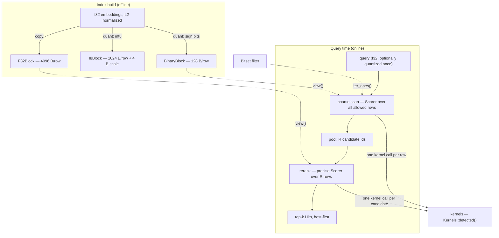
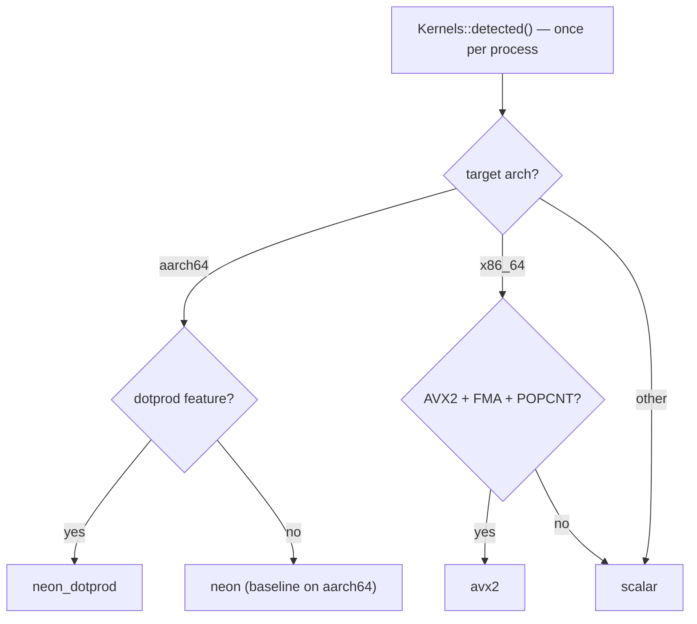
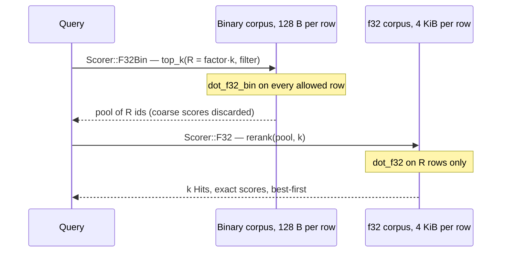

# Concepts

How guksu fits together: the vocabulary (kernel, quantizer, scorer, scan,
rerank) and the design decisions connecting them. The [README](README.md)
covers status, usage, and measured results; module docs carry the binding
contracts. This document is the mental model — read it first, then the
module docs of whatever you touch.

## The problem

guksu searches embeddings: given a query vector, find the k corpus vectors
most similar to it. On L2-normalized embeddings, cosine similarity *is* the
dot product, so "most similar" means "largest dot". M0 does this by brute
force — score every row, keep the best k (a *flat scan*). There is no index
structure yet: the exact scan is the production path for small corpora and,
at every scale, the measuring instrument later milestones (the HNSW graph)
are judged against.

The enemy is memory. At dim = 1024 one f32 vector is 4 KiB, so 1M vectors
are 4 GiB, and a flat scan streams all of it per query. Scans are
bandwidth-bound: the CPU multiplies faster than RAM feeds it. That is why
*quantization* — smaller rows — buys speed almost linearly, and why the
crate's whole shape is "several representations of the same corpus, each
with a kernel that scores it, composed into two-stage searches".



Everything above the kernels is orchestration. A query flows: pick a
representation, bind query to a corpus view (a `Scorer`), scan or rerank,
get `Vec<Hit>`. The rest of this document walks the layers bottom-up.

## What is a kernel?

A *kernel* (in the HPC sense) is the innermost tight loop that does the
arithmetic — here a pure function `(query, row) → score` over two borrowed
slices. Everything else in a search is bookkeeping around n kernel calls,
so kernels are 100% of the per-row math: at 100k × 1024-dim, one query is
~100M multiply-adds through a kernel. That is why they get their own module
(`src/kernels/`), hand-written SIMD, and the strictest contracts in the
crate.

There are five, one per (query encoding × row encoding) pairing:

| kernel        | query × row | returns       | row bytes @1024 | role |
|---------------|-------------|---------------|-----------------|------|
| `dot_f32`     | f32 × f32   | f32           | 4096            | ground truth; exact rerank |
| `dot_i8`      | i8 × i8     | i32, exact    | 1024 + 4 scale  | cheap high-recall scan |
| `hamming`     | bits × bits | u32, exact    | 128             | cheapest coarse scan |
| `dot_f32_bin` | f32 × bits  | f32           | 128             | asymmetric coarse scan |
| `dot_i8_bin`  | i8 × bits   | i32, exact    | 128             | asymmetric, cheaper query side |

Shared properties: they never allocate, they validate input lengths
themselves (a mismatch is a caller bug and panics), NaN/Inf pass through
untouched, and for a fixed backend every kernel is bit-deterministic —
fixed unroll, fixed reduction tree, fixed tail path.

### Score convention

**Higher is better, everywhere.** Dots are similarities (the corpus is
expected L2-normalized, so dot = cosine). Raw `hamming` is the one
lower-is-better distance; `hamming_score` adapts it as `-(h as f32)`. The
`Scorer` layer (below) bakes these formulas in per variant.

### Determinism ladder

- Integer kernels (`dot_i8`, `hamming`, `dot_i8_bin`) are *exact*, hence
  bit-identical across every backend.
- f32 kernels are deterministic per backend but may differ *across*
  backends by summation order (FMA, tree shape). The agreement test bounds
  them against an f64 reference instead of demanding equality.
- Callers that sort scores use `f32::total_cmp`, so NaN cannot poison an
  ordering.

### Backend dispatch

`Kernels` is a vtable: a `Copy` struct of five safe `fn` pointers plus a
`backend` name for logs and bench labels. Three ways to get one:

- `Kernels::detected()` — best for this CPU, resolved once per process.
- `Kernels::scalar()` — the portable reference, also the test oracle.
- `Kernels::by_name(name)` — pin a backend; `Kernels::NAMES` lists the
  candidates for this compile target.



The safety model is *soundness by construction*: a SIMD table is only ever
handed out after runtime feature detection succeeds, and every table entry
is a safe fn that validates lengths before entering its unsafe region. Any
`Kernels` you can obtain is sound to call — `by_name` returns `None` for a
backend this CPU cannot execute, never a crashing table. (x86 subtlety:
AVX2, FMA, and POPCNT are independent target features, so detection checks
all three even though every physical AVX2 CPU has them.)

The free functions (`kernels::dot_f32(...)` etc.) dispatch through
`detected()` on every call — one atomic load plus an indirect call. Inside
a scan loop that overhead is hoisted: `Scorer::select` fetches the table
once per scan and hands each row to a direct `(kern.dot_f32)(q, row)`.

### Implementation tricks worth knowing

Each backend file documents these in place; this is the index of *why* the
code looks the way it does.

| trick | where | why |
|-------|-------|-----|
| independent accumulators | every kernel | Latency hiding: one accumulator serializes on its own dependency chain. Counts vary per kernel and backend — see [Sizing the unroll](#sizing-the-unroll-how-many-accumulators) below. The fixed reduction tree is what makes results deterministic. |
| `sdot` via inline asm | `aarch64.rs` | The dotprod *instruction* is stable hardware; the Rust *intrinsic* (`vdotq_s32`) is still unstable. One asm line with `pure, nomem, nostack` lets LLVM optimize around it. |
| sign-extend + `vpmaddwd`, never `maddubs` | `x86_64.rs` | `maddubs` saturates in i16 (a single ±127 product pair nearly fills the range) and the sign trick needs `abs_epi8`, where `abs_epi8(-128) == -128`. Provider int8 contains −128, so the exact (≈half-throughput) path wins. The alternating-±127 test in `kernels/mod.rs` is the permanent tripwire. |
| XOR sign-flip | `dot_f32_bin`, both SIMD backends | Multiply-by-±1.0 without rounding: broadcast the negated code byte, shift each lane's bit to position 31, AND with `0x8000_0000`, XOR onto the query floats. Exact even for NaN/Inf/denormals. |
| ±1 lane expansion | `dot_i8_bin` | Broadcast code bytes, test against MSB-first bit masks → 0xFF/0x00 lanes, map to +1/−1 via `(mask & 2) − 1`, then reuse the exact int8 dot machinery. |
| u16 drain every ≤512 iterations | NEON `hamming` | Per-lane popcount accumulates ≤16 per u16 lane per iteration; draining to u32 inside that budget means codes of any length count exactly. |
| 4 independent popcnt counters | x86 `hamming` | Scalar `u64` popcnt beats SIMD at these code lengths, but pre-Ice-Lake `popcnt` has a false dependency on its destination register; independent counters break the chain. |

### Sizing the unroll: how many accumulators?

Every main loop above keeps some number of independent accumulators — four
in `dot_f32`, two in `dot_i8`, one in NEON `hamming`. The count is not
style: it is sized per kernel by the questions below, and for the f32
kernels it is contractual — changing the count changes the summation tree,
which changes the bits.

**1. Only the accumulator carries a dependency between iterations.** The
multiply inputs are fresh loads every round, but `acc = op(acc, …)` must
wait for its own previous result. One accumulator therefore runs at one
accumulate per *latency*, even on a core that could *start* several per
cycle:

```
one chain, FMA latency 3:           four chains:
cycle:  1  2  3  4  5  6  7         cycle:  1  2  3  4  5  6  7
acc0:   F₀ ·  ·  F₁ ·  ·  F₂        acc0:   F₀ ·  ·  F₄ ·  ·  F₈
                                    acc1:      F₁ ·  ·  F₅ ·  ·
        every FMA stalls on         acc2:         F₂ ·  ·  F₆ ·
        the previous one            acc3:            F₃ ·  ·  F₇
```

**2. Chains needed ≈ chain latency × sustainable rate** (Little's law for
pipelines). K independent chains lift the ceiling from `1/L` to `K/L`
accumulates per cycle, so K should be the smallest count that reaches the
roof of whichever resource binds first — execution pipes *or* loads. For
`dot_f32` each FMA consumes two vector loads, and both target cores
sustain only ~1–1.5 FMAs' worth of load bandwidth per cycle; with FMA
latency ~3–5 the answer lands at K ≈ 4 on both architectures. Different
micro-architectures, same constant — which is why 4 is the classic
BLAS-microkernel default.

**3. Oversizing costs.** Past the roof, extra chains are dead weight that
still bill you: the unroll doubles, so small and odd dims (the 65s and
1027s in the test matrix) spend longer in the slower narrow/scalar tails;
register pressure grows (NEON has 32 × 128-bit vector registers, AVX2 only
16 × 256-bit, so deep unrolls plus temporaries get tight on x86); and for
the f32 kernels every count change is a new summation order — a
determinism-contract event, not a tuning tweak.

The census, and the sizing logic behind each count:

| kernel | NEON | AVX2 | loop-carried op (latency) | why this count |
|---|---|---|---|---|
| `dot_f32` | 4 × f32x4 | 4 × f32x8 | FMA (~3–5 cy) | the body is nothing but the chain op — only more chains can hide FMA latency; 4 reaches the two-loads-per-FMA roof on both cores |
| `dot_i8` | 2 × i32x4 | 2 × i32x8 | `vpadalq_s16` (~2–4 cy) / `add_epi32` (~1 cy) | the widening multiplies between load and accumulate are independent per-iteration work that fills the pipes; 2 chains suffice |
| `dot_i8` (dotprod) | 4 × i32x4 | — | `sdot` (~3 cy) | multiply is fused into the accumulate, so the body is bare again — FMA-shaped, sized like `dot_f32` |
| `hamming` | 1 × u16x8 | 4 × u64 (scalar) | `vpadalq_u8` / `popcnt` | NEON: a 128-byte row is 8 iterations — the loop is over before pipelining reaches steady state. x86: four counters break the pre-Ice-Lake `popcnt` false dependency; same idiom, unrelated cause |
| `dot_f32_bin` | 2 × f32x4 | 2 × f32x8 | `fadd` (~2–4 cy) | per-byte mask construction (~5 ops) is the real work and overlaps the adds; plain FADD chains are also shorter than FMA |
| `dot_i8_bin` | 1 × i32x4 | 2 × i32x8 | `vpadalq`/`sdot` / `add_epi32` | the ±1 lane expansion dominates the body; the accumulate chain never binds |

The datatype pattern the table keeps repeating:

- **f32 FMA is a long chain in an empty body** → maximum chains. The FMA
  *is* the loop; nothing else hides its latency.
- **Integer accumulates are short chains** (`add_epi32` is 1 cycle) → the
  chain rarely binds, and the count follows the independent body work
  instead — widening multiplies, sign expansion, mask building all give
  the out-of-order core parallelism for free. 1–2 chains suffice.
- **Fused dot instructions (`sdot`) put the multiply back into the
  chain op** → sized like FMA again.
- **Short rows change the question**: at 8 iterations per Hamming row
  there is no steady state to fill, so 1 chain already measures at the
  roof.
- **Sometimes the count isn't latency math at all**: x86 `hamming` keeps
  four *scalar* counters purely to dodge a register false dependency — a
  reminder the idiom generalizes past vector registers.

Wider ISAs re-run the same arithmetic with new constants: an AVX-512 or
SVE backend has more registers and wider lanes, but a two-stream dot stays
load-bound, so the answer stays small — it is register-blocked kernels
(GEMM tiles, where loads amortize over many FMAs) that need the full
latency × ports ≈ 8–10 chains. And the arithmetic only picks the starting
point: the counts above are the smallest that hit each kernel's measured
roof, and `benches/kernels.rs` is the arbiter for changing any of them.

## Representations and quantization

The same corpus can be held at three precisions. At dim = 1024:

```
              bytes per row                                  keeps
f32     ████████████████████████████████  4096   everything (ground truth)
int8    ████████                          1024   magnitude to ~1/255 steps
binary  █                                  128   sign of each dimension only
```

`quant/` produces the two compressed forms. Both quantizers assume
L2-normalized, zero-centered embedding data — that assumption is what makes
the cheap schemes below competitive with fancier ones.

### int8: symmetric linear

`code = round(x / scale)` clamped to `[-127, 127]`, `scale = max|x| / 127`
(per vector via `max_abs_scale`, or corpus-wide via `fixed_scale`). No
zero-point: on zero-centered data an offset would buy nothing and cost a
correction term in every kernel. Rounds half away from zero; never emits
−128 (though the kernels accept it exactly, because provider-quantized rows
can contain it). A dot of two quantized vectors returns to f32 units by
multiplying the two scales: `dot_i8(a, b) · s_a · s_b` — that is exactly
what `Scorer::I8` computes, using the per-row scale the `I8View` carries.
On normalized 1024-dim data the result tracks the true f32 dot within ~0.02
(regression-tested), which is why int8 alone reaches ~0.95 recall@10.

### binary: one sign bit per dimension

The bit rule is `x > 0.0` strictly — both zeros and NaN pack as 0. Codes
are packed MSB-first: dimension `i` lives in byte `i/8`, bit `7 − (i%8)`,
which is numpy `packbits(bitorder='big')` and Voyage `ubinary`, so provider
exports ingest byte-for-byte.

```
src (f32):  +1.0  -1.0  +0.5  +2.0  -0.1  -3.0  -0.5  +1.0
dim:           0     1     2     3     4     5     6     7
bit (x>0):     1     0     1     1     0     0     0     1
bit pos:       7     6     5     4     3     2     1     0
               └────────── byte 0 = 0b1011_0001 ──────────┘
```

A code is `binary_code_len(dim) = ceil(dim/8)` bytes, and **padding bits in
the final byte must be zero**:

```
dim = 13:   byte 0 = dims 0–7      byte 1 = dims 8–12 + 3 padding bits
            1 1 1 1 1 1 1 1        1 1 1 1 1 0 0 0
                                             └─┴─┴─ must stay zero
```

The contract is load-bearing: symmetric `hamming` XORs whole bytes and
relies on equal padding cancelling, so two equal codes with unequal padding
compare *unequal* (there is a test demonstrating exactly this corruption).
The asymmetric kernels decode only the `dim` real bits and never read
padding. `pack_sign_bits` upholds the contract; anything ingesting foreign
codes must too.

Why sign bits work at all: for L2-normalized vectors, the fraction of
agreeing signs is a proxy for the angle between vectors. It is a coarse
proxy — 1024-bit codes admit only 1025 distinct Hamming values, so ties are
massive — which is precisely why binary is used as a *coarse* stage, not a
final ranking.

### Asymmetric scoring: the key idea

A *symmetric* scan encodes both sides the same way (f32×f32, i8×i8,
bits×bits). An *asymmetric* scan compresses only the corpus and keeps the
query precise: the corpus is n rows and dominates memory, while the query
is one vector per search — its precision is effectively free.

`dot_f32_bin` scores `Σ qᵢ · (2bᵢ − 1)`: the dot of the full-precision
query against the row's ±1 reconstruction. Compared to Hamming it weighs
each agreeing/disagreeing dimension by the query's actual coordinate
magnitude, which breaks the tie plateaus — on the README's synthetic run,
raw recall@10 goes 0.26 (symmetric Hamming) → 0.32 (asymmetric), and after
an ×8 f32 rerank 0.95 → 0.97.

Two cost nuances. First, asymmetry moves the bottleneck: a Hamming scan
reads 128 B per row and is popcount-bound (~3 ns/row), while `dot_f32_bin`
still touches all 1024 query floats per row (~75 ns/row) — a flat
asymmetric-f32 scan costs about as much wall time as a plain f32 scan. Its
win is the 32× smaller resident corpus, which is what matters once the
corpus must stay cache/RAM-resident (and for the future graph search).
Second, `dot_i8_bin` (quantize the query once, then integer math) recovers
most of the speed — ~2.2× cheaper than the f32-query variant — and loses
essentially nothing: query-side int8 error is second-order, and the recall
tables show the i8-query rows matching the f32-query rows to three decimals.

### Provider parity

Several embedding APIs serve pre-quantized outputs. The quantizers here are
built to *reproduce* them client-side from an f32 export, so a corpus can
be re-quantized locally without re-embedding. `quant::parity` measures the
match on a sample (`binary_parity`, `int8_parity`) and converts Voyage's
offset-binary i8 codes (`XOR 0x80` per byte). One diagnostic worth
memorizing: a `bit_mismatch_rate ≈ 0.125` concentrated on the first bit of
every byte means someone ingested offset-binary bytes without converting.

## Scanning

A scan is the brute-force loop: stream candidate ids, score each row with
one kernel call, keep the k best. `src/scan.rs` builds this in two layers.

### The selection core

`select_top_k(candidates, score, k)` is the only loop: it keeps a bounded
min-heap of the k best hits seen so far (a candidate replaces the current
worst only if strictly greater), then sorts the survivors best-first.
O(n log k) worst case, no allocation beyond the k-slot heap, and — because
the ordering is total and ids are unique — the result is a deterministic
function of the candidate *set*, independent of stream order. Every
`Scorer` scan and rerank is a thin wrapper over this one function.

### Scorer: a query bound to the representation that scores it

```rust
Scorer::F32Bin { query: ViewQuery { view: bins.view(), query: &q } }
    .top_k(k, filter)
```

`Scorer` is a `Copy`, borrow-only enum with one variant per kernel — `F32`,
`I8`, `Bin`, `F32Bin`, `I8Bin` — so only meaningful (corpus view × query
encoding) pairings are representable, and the variant fixes the score
formula (e.g. `I8` multiplies in both scales; `Bin` negates Hamming;
`I8Bin` multiplies in the query scale to stay in dot units). `ViewQuery`
bundles the two sides; its query type defaults to the view's canonical
encoding (`CorpusView::Query`), so only the asymmetric variants spell a
query type explicitly. Int8 queries travel as `I8Query { codes, scale }` —
the codes are meaningless without their scale, so the pair is one value.

Internally `select` matches the variant *once per scan*, hoists the kernel
table, and hands a concrete closure to `select_top_k` — the per-row path is
one indirect kernel call, no per-row dispatch.

### Filters

`top_k` optionally takes a `Bitset` over the id universe (`len` must equal
the view's rows — anything else is a `ScanError::FilterLen`). A filtered
scan iterates `iter_ones()`, so cost scales with the *set* bits, not the
corpus size. Rerank needs no filter parameter: its candidate list is
already the pool, and a pool built from a filtered scan stays inside the
filter.

### The ordering contract

A `Hit` is greater (better) than another if its score is higher under
`f32::total_cmp`, or the scores are equal and its id is *lower*. Every
result vector is sorted best-first under that rule — ground truth, top-k,
and rerank alike. Two consequences:

- **Ties are handled, not hoped away.** Binary scores tie constantly (1025
  possible values at 1024 bits); the id tiebreak is what makes results and
  recall numbers bit-reproducible across machines and backends.
- **Prefix property**: `top_k(k1) == top_k(k2)[..k1]` for `k1 <= k2`.
  Deepening a search refines it; it never reshuffles what you already had.

(`Hit`'s `PartialEq` is defined via `Ord`, not f32 `==`, so `-0.0`/NaN
cannot make equality disagree with the ordering.)

### Errors at the seam, asserts below it

Two seams return errors instead of panicking, and `src/error.rs` wraps both
in one crate-level `Error` (with `From` impls) for callers composing them
behind a single `?`:

- The scan API returns `ScanError` (`QueryDim`, `FilterLen`) — a query or
  filter whose shape does not match the view.
- Block and view constructors (`F32Block::from_flat`, the raw-parts
  `*View::new`) return `StorageError` (`ZeroDim`, `Ragged`, `Stride`,
  `ScaleCount`, `TooManyRows`) — inconsistent geometry, validated up front
  because the view constructors are exactly where M1's mmap parser will
  ingest foreign bytes, and a parser must reject, never panic.

Below the seams, kernels and row accessors keep assert-based contracts — by
the time a kernel runs, shapes were either validated by the layers above or
are the caller's bug. One wrinkle: packed-bits queries have a byte length,
not a dim in view units, so they opt out of the scan-time dim check
(`QueryData::dim = None`) and the Hamming kernel validates them per row
instead.

## Two-stage search: coarse → precise

The central composition. Scan the cheap representation over everything to
build a candidate pool, then re-score only the pool from a precise
representation:



The one rule: **scores are representation-local.** A Hamming-derived score
and a dot score are not comparable, and even two dot scores from different
precisions are not blendable. `rerank` therefore *recomputes* every
candidate's score from its own view and discards the pool's coarse scores.
Rerank from a strictly more precise representation than the pool's source.

Why it works: coarse recall@R is much better than coarse recall@k. Binary
@10 collapses into tie plateaus (0.26), but the true top-10 almost always
hides inside the binary top-80 — so an ×8-deep pool plus exact rerank
reaches 0.95, at a fraction of full-precision cost. From the README's
100k × 1024 synthetic run:

| config                  | recall@10 | µs/query |
|-------------------------|-----------|----------|
| f32 flat scan (control) | 1.0000    | 1432     |
| int8 symmetric          | 0.9494    | 248      |
| binary symmetric, raw   | 0.2591    | 30       |
| bin sym → f32 ×8        | 0.9491    | 71       |
| bin asym i8q → f32 ×8   | 0.9747    | 261      |

The cost model is `n · cheap + R · expensive` against `n · expensive`, with
R = factor·k ≪ n — plus the resident-memory win, which is the real point at
scale. Rerank recall is monotone in depth, so the factor is a tunable
recall/latency dial. (Synthetic numbers calibrate the machinery, not
binary viability — that judgment belongs to real embedding exports; see
the README.)

## Storage: blocks and views

`storage.rs` separates *owning* from *reading*:

- **Blocks** (`F32Block`, `I8Block`, `BinaryBlock`) are owned, row-major
  convenience containers: copy-in constructors (`F32Block::from_flat`) and
  quantizing constructors (`I8Block::from_f32_per_vector` /
  `::from_f32_fixed`, `BinaryBlock::from_f32`) that uphold the quantizer
  contracts for you. All three implement the `Block` trait — `len`, `dim`,
  `is_empty`, and `view()` through a generic associated type — so build-side
  code can be generic over the representation.
- **Views** (`F32View`, `I8View`, `BinaryView`) are `Copy` borrows — the
  only thing scans and kernels ever read. `row(i)` returns exactly `dim`
  elements; `I8View::scale(i)` rides alongside for the score formula. The
  raw-parts `*View::new` constructors validate geometry and return
  `StorageError` — they are the ingestion path a mapped file will use.

```
offset:   0                stride              2·stride
          ├── row 0 ──┬pad─┼── row 1 ──┬─pad──┼── row 2 …
          └── dim ────┘    └── dim ────┘
```

Row starts are padded to a 64-byte stride. At dim = 1024 every
representation is already 64-byte-strided (4096, 1024, and 128 are all
multiples of 64), so the padding is free where it matters. Views require
only `stride >= row_len` and make *no* absolute-alignment promise, which is
why every SIMD kernel uses unaligned loads. Ids are `u32` (a block refuses
more rows than the id space).

The split is the crate's forward seam: **M1's zero-copy mmap format will
implement the view side.** When rows come from a mapped file instead of a
`Vec`, scan and kernel code does not change — they never knew about blocks
in the first place.

## Measuring: ground truth, recall, and determinism

Because the flat f32 scan is exact and the ordering is total, ground truth
is just `Scorer::F32::top_k` — same code path, same tie rule. recall@k is
the overlap between a config's top-k and that ground truth. The `recall`
harness (`src/bin/recall`, `--features harness`) sweeps the whole matrix —
{int8, binary, binary→int8 rerank, binary→f32 rerank} × {symmetric,
asymmetric} × rerank depth × filter selectivity — on synthetic GMM data or
real `.npy` exports. That matrix is M0's reason to exist: choose a
quantization config on evidence before any graph work begins.

The verification stack underneath:

- `tests/kernel_agreement.rs` runs every backend the CPU supports against
  the scalar oracle — exact equality for integer kernels, an f64-referenced
  bound for f32 — across a dimension list (1, 2, 3, 7, 8, 9, … 1024, 1027)
  chosen to cross every lane width, byte boundary, and unroll boundary.
- `GUKSU_REQUIRE=<backend>` makes the test suite fail if detection picked
  anything else — so CI runners provably exercised their intended path.
- In-module kernel tests pin semantics: int8 exactness at ±127/−128,
  NaN/Inf pass-through, the padding contract, sign-flip exactness, and a
  statistical bound tying scaled int8 dots to f32 dots.
- All randomness is `rng::SplitMix64` (doc-hidden) — seeded, dependency-
  free, with substreams — so every test and harness run is reproducible.
- `benches/` measures kernels and scans; `simsimd_compare` cross-checks
  against a C baseline.

## Repo map

| path                        | contents |
|-----------------------------|----------|
| `src/kernels/mod.rs`        | kernel contracts, `Kernels` vtable, detection, free fns |
| `src/kernels/scalar.rs`     | portable reference — the test oracle |
| `src/kernels/aarch64.rs`    | NEON backend (+ dotprod upgrade for int8) |
| `src/kernels/x86_64.rs`     | AVX2 backend |
| `src/quant/binary.rs`       | sign-bit pack/unpack (MSB-first) |
| `src/quant/int8.rs`         | symmetric int8 quantize/dequantize, scales |
| `src/quant/parity.rs`       | provider-parity checks, offset-binary conversion |
| `src/storage.rs`            | `Block` trait, owned blocks + borrowed views (the mmap seam), `StorageError` |
| `src/query.rs`              | `ViewQuery`, `CorpusView`, `QueryData`, `I8Query` |
| `src/scan.rs`               | `Hit`, `select_top_k`, `Scorer`, `ScanError` |
| `src/error.rs`              | crate-level `Error` wrapping `ScanError`/`StorageError` |
| `src/bitset.rs`             | filter bitmap (`iter_ones` drives filtered scans) |
| `src/rng.rs`                | SplitMix64 (tests/harness; doc-hidden) |
| `src/bin/recall/`           | recall benchmark harness |
| `tests/kernel_agreement.rs` | SIMD-vs-scalar agreement gate |
| `benches/`                  | kernel/scan Criterion benches, simsimd cross-check |

## Glossary

| term | meaning |
|------|---------|
| kernel | innermost scoring function: `(query, row) → score`, one call per candidate row |
| backend | one SIMD implementation set of all five kernels (`scalar`, `neon`, `neon_dotprod`, `avx2`) |
| oracle | the scalar backend, which every SIMD backend must agree with |
| quantization | re-encoding f32 rows into fewer bytes (int8: 1 B/dim; binary: 1 bit/dim) |
| scale | the f32 factor that returns int8 codes to f32 units; per-vector or corpus-wide |
| binary code | packed sign bits, MSB-first, `ceil(dim/8)` bytes, padding bits zero |
| symmetric | query and row share an encoding (f32×f32, i8×i8, bits×bits) |
| asymmetric | precise query × binary row (`dot_f32_bin`, `dot_i8_bin`) |
| scan | score a candidate stream with one kernel, keep the top k |
| filter | `Bitset` restricting a scan to set ids; cost scales with set bits |
| pool / R | candidate ids surviving the coarse stage; R = rerank factor × k |
| rerank | re-score a pool from a more precise view; never blends coarse scores |
| representation-local | scores compare only within one (kernel × representation); the reason rerank recomputes |
| ordering contract | `(score descending, id ascending)` under `total_cmp`, everywhere |
| prefix property | `top_k(k1) == top_k(k2)[..k1]` — deeper search only extends results |
| recall@k | fraction of ground truth's top-k an approximate config recovers |
| block / view | owned container / borrowed `Copy` reader; views are what scans consume and what M1's mmap format will implement |
